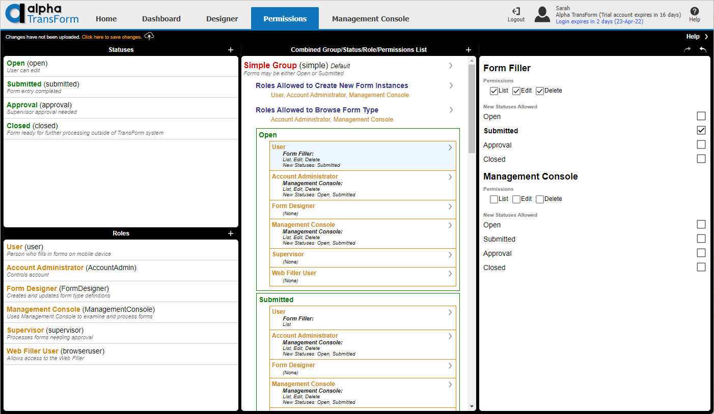

# Managing Forms in TransForm Central

Whenever a TransForm user uploads forms from the TransForm App, they are updated in the Management Console in TransForm Central. 

The Management Console is where you can view and manage user forms, including adding comments, editing forms, adding new forms, and exporting forms from TransForm Central. Let's take a look at the Equipment Inspection form that was submitted in the previous tutorial.

## Viewing Uploaded Forms

1. Go to [transform.alphasoftware.com](https://transform.alphasoftware.com)

    

2. Click on the "Management Console" tab.

    

3. To view forms, you must first choose a Form Type. A "Form Type" is what you created at the beginning of the tutorial -- the "Equipment Inspection" Form Type. A "form" is what you created on your mobile device and then uploaded in part 2 of the tutorial. To view the "forms" uploaded to the TransForm cloud, you must first select the "Form Type" on the Management Console. Select the "Equipment Inspection" Form Type from the list to view the form you uploaded to the TransForm cloud in the previous tutorial.

    

4. After selecting the "Equipment Inspection" Form Type, you should see the form you uploaded to the TransForm cloud in the previous tutorial. Select the form from the list.

    

When you select a form, the form's fields and values will be shown in the Form Contents column. Several actions are available in the Actions column:

 - "Export Selected Form" - Allows you to export one or more forms from TransForm Central to another file format and downloaded or emailed. Use the checkbox in the form list to select multiple forms for export.
 - "View Comments" - Allows you to view and add comments to a form.
 - "Delete Selected Form" - Deletes the form. **Be careful! There is no undo for this action.** Use the checkbox in the form list to select multiple forms to delete. 
 - "Prevent Form Filler from downloading" - This setting is used to prevent a form from being downloaded to the user's device. If set to "Yes", the form will be removed from the user's device the next time they download updates from the TransForm cloud.
 - "User ID" - The user to which the form belongs. Use the "Revert" button to set the form owner back to the original user.
 - "Change Status" - Used to change the form status, e.g. from "Open" to "Submitted".

## Inviting Users

Now that you have created a Form Type and verified that it captures the data you need, you are ready to invite other users to your TransForm Account. User management is done on the Home tab in TransForm Central. Let's go there and invite some users.

1. Click on the "Home" tab in TransForm Central.

2. Click "Invite Users to Join TransForm Account"

    

3. Enter an email addresses for people you want to join your TransForm account. Enter one email address per line. For example:

    ```
    alice@example.com
    betty@example.com
    charlie@example.com
    ```

    All users will be automatically assigned the user role "User" when they accept the invitation. You can optionally set the roles for a user when you invite them to TransForm. For example, in the list below, charlie@example.com will be assigned the User and FormDesigner roles when they join the TransForm account:

    ```
    alice@example.com
    betty@example.com
    charlie@example.com|User,FormDesigner
    ```

4. After you have entered the email addresses for the people you'd like to invite, click the "OK" button to send the invitations.

    When you invite users to your TransForm account, an email is sent to each address entered in the Invite Users text box. Users will not be added to your TransForm account until they accept the invitation.

5. You will see a notice when TransForm finishes sending the invitations. Review the message to ensure there were no issues then click "OK" to dismiss the message.

    


## Adding Users versus Inviting Users

In addition to Inviting Users, you can also Add Users. Adding users works differently from inviting users. When a user is invited, they are sent an invitation via email to join your TransForm account. An invited user is not added to the TransForm account until they accept the invitation.

Adding a user immediately adds the user to your TransForm account without asking them to opt-in to the account. A user who is added is also sent an email to them, but rather than inviting them to TransForm, it tells them they have been added to your account. You can immediately assign roles to a user that is added to a TransForm account using "Add Users".

The process for adding users is similar to the process for inviting users:

1. On the Home tab in TransForm Central, click "Manage users".

2. Click "Add users".

    

3. Enter the email addresses for people you want to add to your TransForm account. Enter one email address per line. For example:

    ```
    don@example.com
    evelyn@example.com
    ```

4. After you have entered the email addresses for the people to add to your TransForm account, click "Add Users". This adds the users to your TransForm account. Each account will be assigned the "User" role. You can manage roles for users using User roles, which is discussed in the next section.

## User Roles

User Roles define what privileges a user who is a member of your TransForm account can do. 

TransForm has several pre-defined roles. The actions that a user can perform in each role are listed below:

- "User" - Can fill out and submit forms using the TransForm filler app.
- "Account Administrator" - Can add other users and set roles.
- "Form Designer" - Can design Form Types.
- "Management Console" - Gives user access to the Management Console where submitted data can be reviewed.
- "Supervisor" - Can manage submitted forms on the Management Console (assign a form status of submitted, closed, approved, etc.) Typically used in a workflow where submitted forms require approval before they can be marked closed or complete by a user.

User roles are assigned through the Home tab. To view and assign user roles for users in your TransForm account, follow the instructions below:

1. On the Home tab in TransForm Central, click "Manage users".

2. Click "User roles".

3. Select the user from the list that you would like to view or modify their roles. Use Ctrl+Click to assign multiple roles to a user.

    

4. When you are satisfied with the assign roles, click "OK" to assign the roles to the user.

5. Repeat the previous two steps for each user.

In addition the pre-defined roles, you can create your own roles on the Permissions tab. We will not go into detail on how that is done, however you can find information on how the Permissions tab works and how to create your own in the TransForm Central help. To access the help, go to the Permissions tab and click on the "Help" button located in the upper right-hand corner of the tab.



## TransForm Review

1.