# Welcome to Alpha TransForm

To begin, go to [transform.alphasoftware.com](transform.alphasoftware.com) and create a new account or login.


## Create Your Account

1. If you do not have a TransForm account, create one now. Click the "register" button and follow the instructions. When you have created the account and verified your email address, return to [transform.alphasoftware.com](transform.alphasoftware.com) and login.
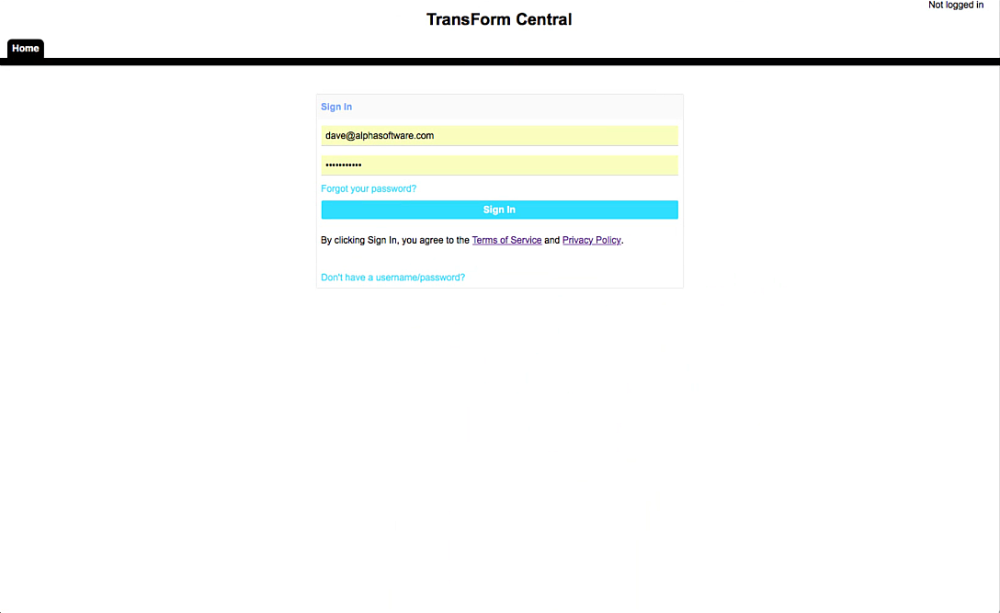
2. After you have entered your username and password, choose an account. If this is your first time using Alpha TransForm, you will only have one account.
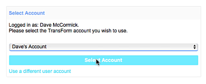
## Activate Your License

If you have not activated your TransForm license, enter your license now by following the instructions below:

1. Click "Account License"
2. Enter your license in the text box and click Activate.
3. Finally, log out of TransForm Central and login again.

## TransForm Central Overview

TransForm Central has four tabs: Home, Designer, Permissions, and Management Console.

The Home tab is where you can change your password, change your account name, add users to your account, and perform other account administrative tasks. The Home tab is also where you can get your TransForm API key.


The Designer tab is for building and editing Form Types.
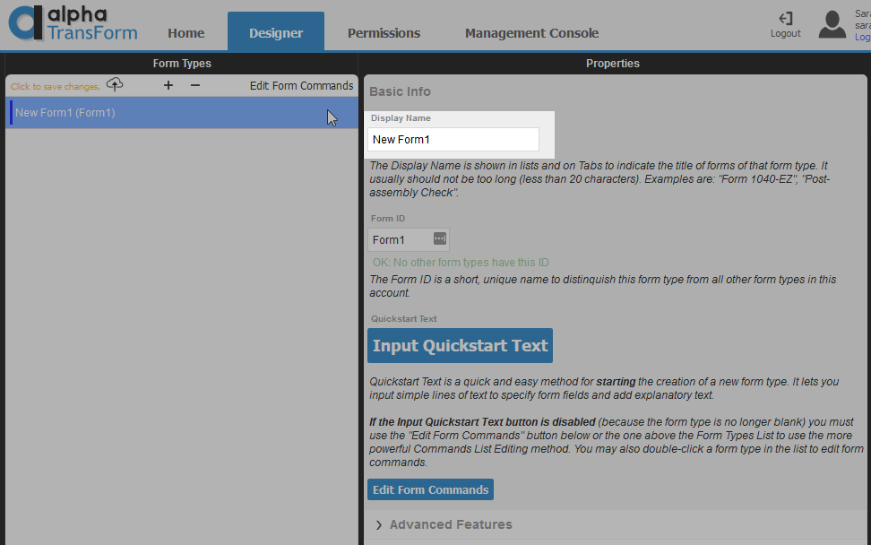

The Permissions tab is an advanced tab for creating different user roles.


The Management Console is where you can review and export data.


## Create Your First Form Type

Now that you have created and registered your TransForm Central account, you can start designing forms. Let's begin by creating a new blank form. This is done on the Designer tab.

The Designer tab has three sections - a column on the left that lists the Form Types for your account, a column in the center that displays all of the details for a selected form, and a column on the right that shows a preview of the form. In the upper right-hand corner above the Preview Pane, you will also see a help icon. Clicking the help icon opens the help documentation for the Designer tab and contains information on how to use the Designer.

1. Click on the Designer tab. The first time you open the Designer tab, a message will appear telling you that No Form Types are defined for your account. You will be presented three options:
   - "Add blank" - Opens the Designer and creates a new application form from scratch.
   - "Add shared" - Opens the Designer and creates a new application based on a pre-defined template.
   - "Cancel" - opens the Designer but does not create a new form.
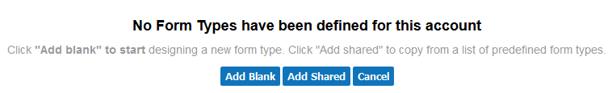

2. Click "Add Blank" to create your first form. Alpha TransForm will create a new Form Type called "New Form 1" and select it from the list of forms.


3. Let's give the form a meaningful name. Type "Equipment Inspection" in the form name. Note that the form preview window to the right is updated after you change the form name.
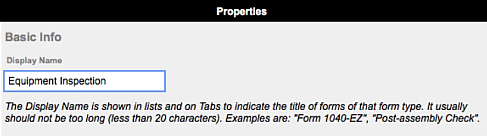


4. Now that the form has a name, let's add some fields. To start, click the "Input Quickstart Text" button. This opens the Quickstart Text editor where you can quickly added multiple fields to a form.
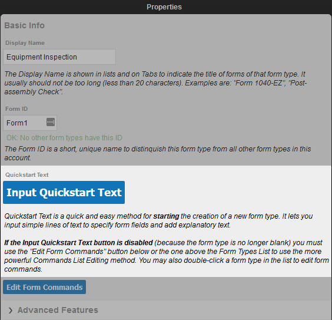

5. Let's get familiar with the interface by adding a few basic fields and seeing what happens. Each form field is defined on its own line. Enter the following into the Quickstart Text editor:
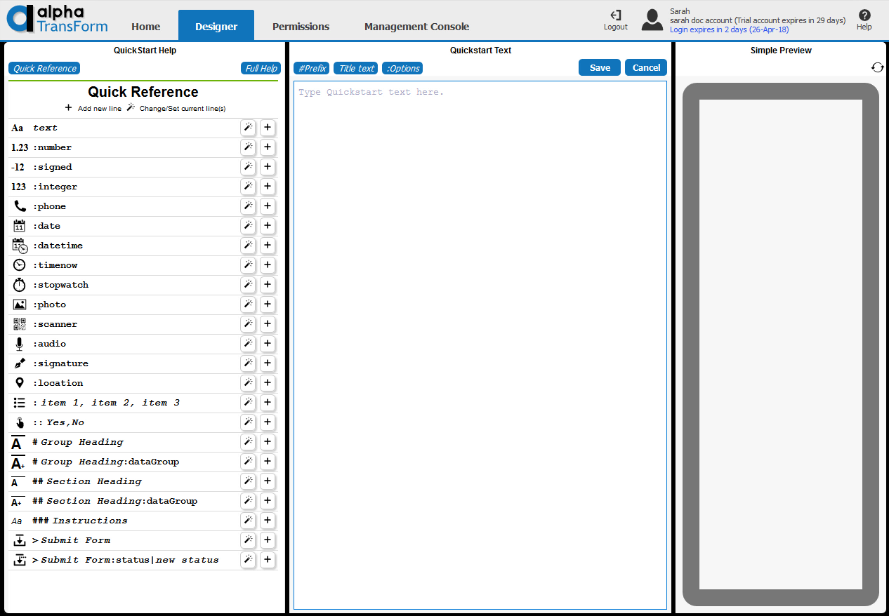
```
First Name
Last Name
Address1
Address2
City
State
ZIP/Post Code
```

6. This text defines 7 text input fields for the form that can be used to capture the following information: first name, last name, address, city, state, and zip or postal code. Note that the preview window to the right now shows 7 fields representing each line of text entered in the Quickstart Text editor. This is an approximate preview of what the form will look like. The preview window shows the label for the field and the field type. Clicking on a field in the preview window will select it in the Quickstart Text editor.
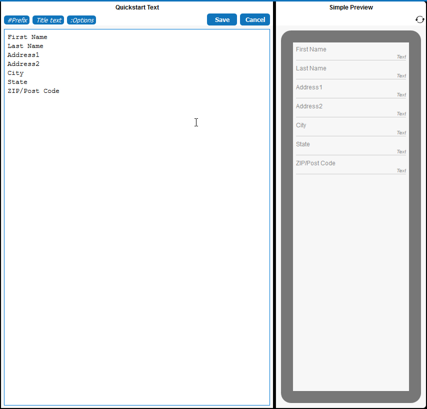

7. Now that you understand how the preview window works, let's build the Equipment Inspection app. Delete all of the text in the Quickstart Editor.


8. Enter "Equipment Id" in the editor to add a field for the equipment id.

9. On the next line, enter "Equipment Type" in the editor. Then, click the "Set" link for the "" field type in the Quick Reference. This will make the "Equipment Type" field a list of choices.
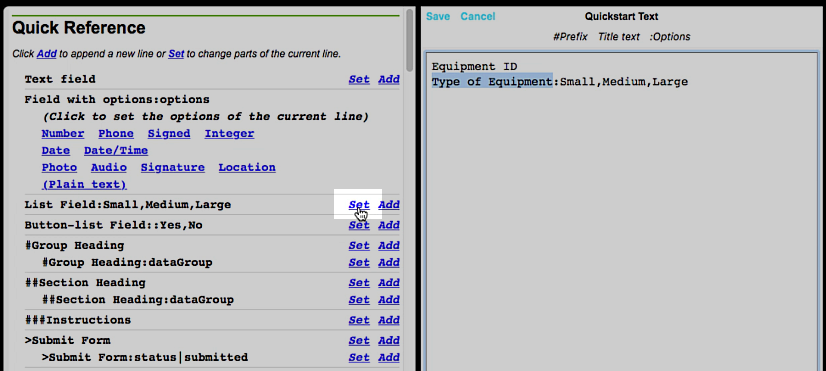

10. Change the list of choices "Small, Medium, Large" that were inserted for the Equipment Type filed to "server, router, power supply".
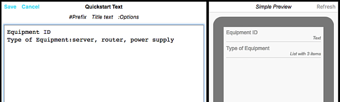

11. On the next line, enter "Equipment is Working". Then, click the "Set" link for the "Button List" in the Quick Reference. This will format the Equipment is Working field as a button list with two options: Yes and No. Keep the default choices.
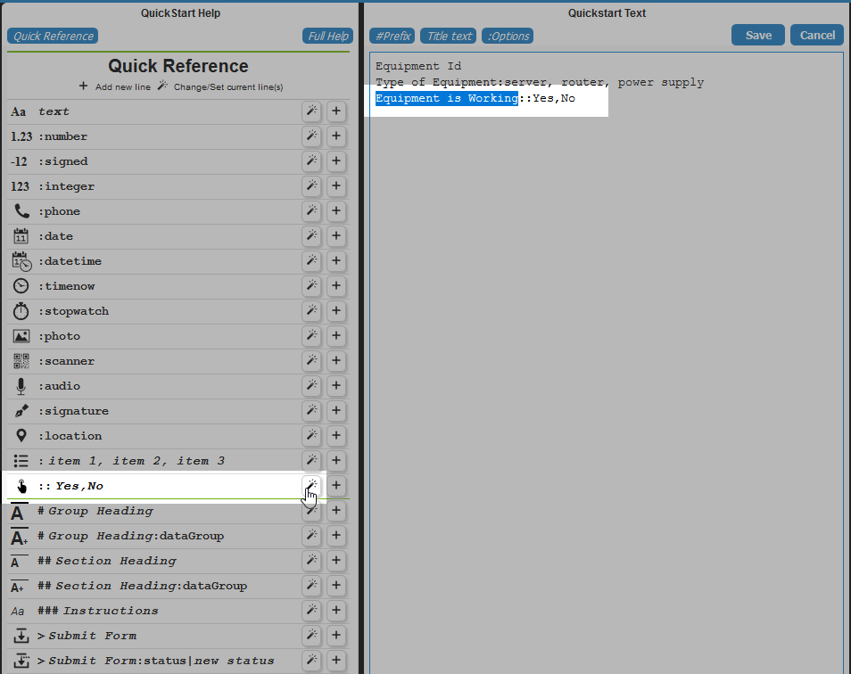

12. Add three more fields: "Equipment Location", "Equipment Photo", and "Inspection Signature". When you have added these three fields, the Quickstart Editor should contain the following text:
```
Equipment Id
Equipment Type:server, router, power supply
Equipment is Working::Yes,No
Equipment Location
Equipment Photo
Inspector Signature
```

13. Click on the Equipment Location field in the preview window. Then click the "Location" link in the Quick Reference. This will set the field type for the Equipment Location field to "location". A location field is a special field that captures the user's current location and renders it as a map in the form.
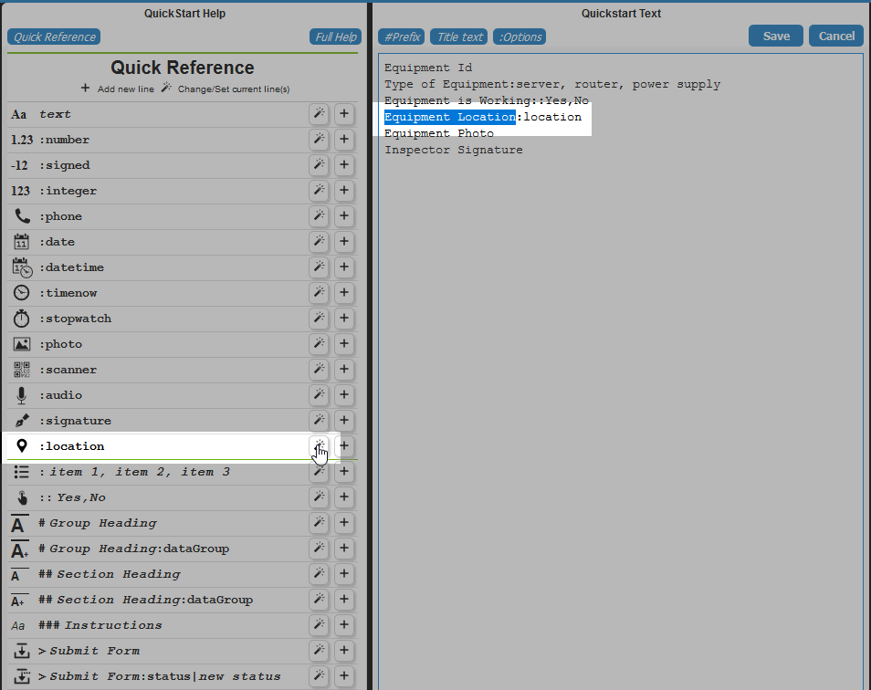

14. Next, click the Equipment Photo field in the preview window. Then, click the "Photo" link in the Quick Reference. This will set the field type for the Equipment Photo field to "photo". A photo field is a special field used to capture images on the user's device. It opens the user's camera and lets them take a photo, which is then saved and displayed in the form.
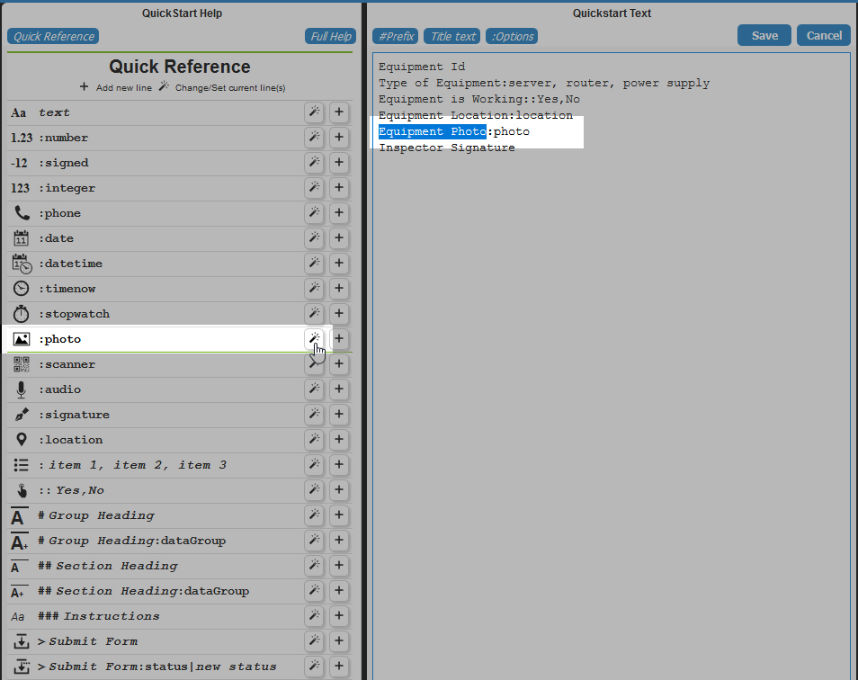

15. Finally, click the Inspector Signature field in the preview window. Then, click the "Signature" link in the Quick Reference. This will set the field type for the Inspector signature field to "signature". A signature field presents the user with a signature editor that they sign with their finger or stylus. In addition to capturing the user's signature, it also capture the date and time the signature was added. The Quicktext Editor should match the text below:
```
Equipment Id
Equipment Type:server, router, power supply
Equipment is Working::Yes,No
Equipment Location:location
Equipment Photo:photo
Inspector Signature:signature
```
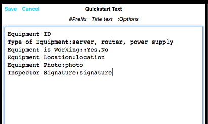

16. Review the fields in the Preview to verify that the field types for each field:
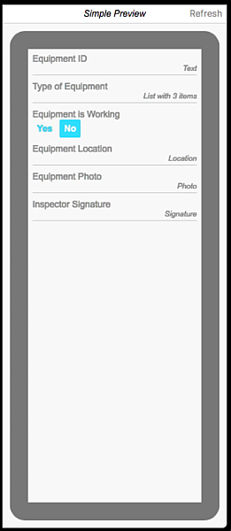

17. Let's save the Equipment Inspection form and try it out on a mobile device. Click the "Save" link to save the Equipment Inspection form and return to the list of forms.
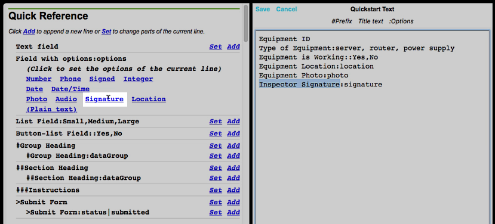

17. Click "Upload" to push the new form to TransForm so that it can be accessed on a mobile device.
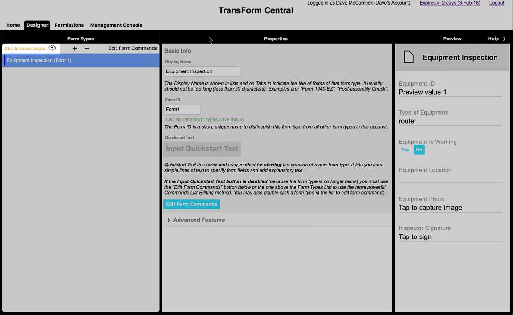

18. Wait for the upload to finish.
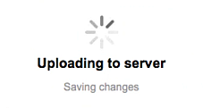

19. Finally, click "OK" to close the upload confirmation window.
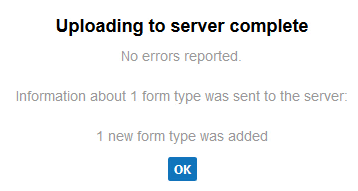

Now that you have created and uploaded a Form Type, let's go try it out.

Next [TransForm Tutorial Part 2: Using the TransForm App](usingTheApp.md)