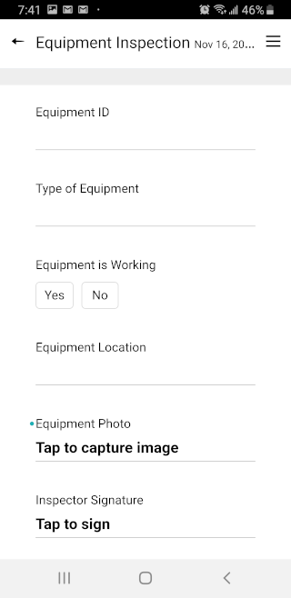

# Using the TransForm App

Let's check out our Equipment Inspection form on the TransForm app.

## Login to TransForm

1. Launch TransForm on your mobile device. If you don't have TransForm installed on your device, you can download it from the iOS or Android App store.

2. When prompted, log in to TransForm.

    

3. If you are a member of more than one TransForm account, you will be prompted to select your account. Select your account from the list of accounts. Otherwise, skip this step and move on to the next section.

    

## Create a New Equipment Inspection Form

When you have logged in, you will see two tabs: Existing Forms and Add Form. Existing Forms displays a list of all of the forms you have filled out. Add Forms is where you can create a new form from a list of Form Types. Let's create a new Equipment Inspection form.

1. Tap Add Form.

    

2. On the Add Form tab, you should see the "Equipment Inspection" form you created in TransForm Central. Create a new Equipment Inspection form by tapping the "Equipment Inspection" form.

    

3. After tapping "Equipment Inspection", TransForm will open a new, blank copy of the Equipment Inspection form.

    

## Fill out the Equipment Inspection Form

Let's fill out the form. 

1. Tap the "Equipment Id" field. This opens the text editor.

    

2. Tap the line at the top and type "A123" for the Equipment Id number.

    

3. After entering the Equipment Id, you have two options for saving the change. You can tap the check mark button to save the entry and go back to the form.  

    

    The arrow buttons can be used to move to the next or previous field in the form.

    

    You can also tap the x button to cancel and return to the form without saving your changes.

    

    Tap the check mark to save your changes and return to the form.

    

4. Next, tap the "Type of Equipment" field. Select the "power supply" equipment type from the list of choices. Then, tap the check mark to save your selection and return to the form.

    

5. Let's assume we have inspected the power supply and found that it works. Tap the "yes" option for the "Equipment is Working" field.

    

6. Tap the "Equipment Location" field. The location editor captures your current location. To do this, tap the "Get Location" button. Capturing the location can take a little time to get an accurate reading.

    

    When the process completes, a map will appear with the captured location. If you are in an area with no wifi or cell service, the map won't appear. But don't worry, TransForm will still accurately collect the GPS coordinates.

    

7. Tap the check mark button to return to the form. Then, tap the Equipment Photo field.

    

8. Tapping the photo field will open your camera so you can take a picture. Take a photo of a nearby object.

    

9. When you are asked if you want to use the photo or retake it, choose "use the photo". Then, tap the check mark button to save the photo.

    

    

10. The last thing you need to do to complete your form is sign the Inspection Signature field. Tap the Inspection Signature field to open the signature editor.

    

11. Using a stylus or your finger, sign the screen. When you are done, tap the check mark button to save the signature and return to the form.

    

12. Note that in addition to the signature, the date and time of the signature was also captured - shown below the signature on the form.

    

13. Now that all of the fields have been filled out, we can exit the form. Tap done to return to the list of forms.

14. You will notice that you are now on the Existing Forms tab after finishing the Equipment Inspection form. If you want to make changes or add additional information to a form, double-tap the form or select the form then tap the Edit button at the top of the screen.

    

## Uploading Forms to TransForm Central

So we’ve filled out the form and all of the data is saved on the phone. Now it’s time to upload that data so we can see it in TransForm central.

Before we do, take a look at the the blue line next to the form. The blue indicates this form has not yet been saved to the TransForm cloud. 

Forms are saved to the TransForm cloud using the Upload now button. Tap the Upload Now button to upload the form to the TransForm could. 

After a few seconds, the blue lines will disappear indicating the changes are now uploaded.

Let's go back to TransForm Central to see the uploaded form.

Next [TransForm Tutorial Part 3: Managing Forms in TransForm Central](dataManagement.md)